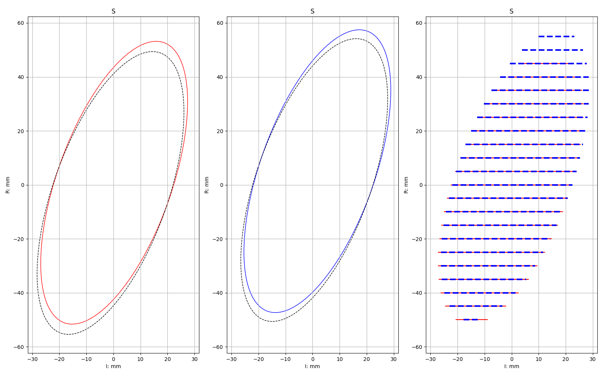
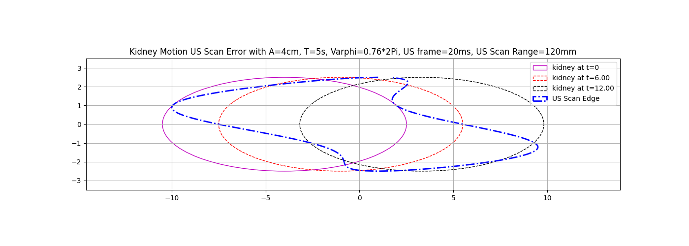

Research Algorithm (After Oct 2022)
===
> All python packages can be installed once by using the `requirements.txt`. (Updating)

# Research Topics

## 1. Attenuation Assessment

- Reference: [Lark Doc - Attenuation Estimation Test (A-lines)](https://ultrastmedtech.feishu.cn/wiki/wikcnsr1o98PfNPAhSZfHAuUhub)
- Result in short: not good, impossible to get any information, Stork has TGC well designed and applied already in RF data.
- Python Requires Packages: `python 3.9`, `pip install natsort matplotlib numpy pathlib scipy`

## 2. Muller Hydrophone

- Reference: [Lark Doc - Muller hydrophone test - 29 Mar测试验证 Experiment and Validation](https://ultrastmedtech.feishu.cn/wiki/wikcnsCxxGvq26Eae6v5d61zUsc)
- Get the relationship between Voltage and Pressure, and print out polynomial orders: `p(x) = p[0] * x**deg + ... + p[deg]`
- Result in short:
    - Negative Pressure Fit Parameters are: [ 3.49e-05 -2.42e-02 -2]
    - Positive Pressure Fit Parameters are: [-1.15e-04  9.41e-02  1.83]
- Python Requires Packages: `pip install matplotlib numpy pathlib`

## 3. 3D Scan Error Estimation in Kidney Motion

- Reference: [Lark Doc - 发明：肾脏运动方向、超声图像平行度的机构和调整方法（魏可欣-鼎合诚）](https://ultrastmedtech.feishu.cn/wiki/wikcnFkhKIQjcAizJezdMf3Woqe)
- Two error estimation methods
    1. Random Location 3D Scan
       
    2. Aligned Moving Direction 2D Scan
    3. 
- Python Requires Packages: `pip install matplotlib numpy pathlib`

## 4. Thermal Effect Estimation in Sweep Mode

- Reference: [Lark Doc - Thermal Effect Assessment](https://ultrastmedtech.feishu.cn/wiki/wikcnFMptyltJkKYTW1GhhLkvEb)
- [Useful image processing tutorial](https://docs.opencv.org/3.4/dd/d49/tutorial_py_contour_features.html)
- required python packages: `pip install matplotlib numpy pandas pathlib`
    - `opencv` installation: `pip install opencv-python`, `pip install opencv-contrib-python`
- Todo-list
    - [ ] xz scan
    - [ ] 3d scan

## 5. Dual Directional Coupler As PCD

- Reference: [Lark Doc - Dual Directional Coupler Signal Feedback as BBN](https://ultrastmedtech.feishu.cn/wiki/wikcnOiiR3pH9HWGvUiffjVgwLc)
- Unfinished and on hold

## 6. Medical Registration Algorithm

- Reference: [Lark Doc - Test Image Segmentation Apps and Algos](https://ultrastmedtech.feishu.cn/wiki/wikcnyGfU2OR8JE3IoRvT6dSOpc)

- Python code is in `6_medicalImageREgistration.py`

    - OpenCV:  install using `pip install opencv-python`, `pip install opencv-contrib-python`
    - Todo
        - [ ] [elastix](https://elastix.lumc.nl/)
        - [ ] [MIRTK](https://mirtk.github.io/index.html)
        - [ ] [SimpleITK](https://simpleitk.org/)

- Matlab code is in `code_matlab/6-medical-registration`:

    1. `Run1_experiment_collected_data.m`: try `imregister` result with the collected data in [Lark doc recorded experiment](https://ultrastmedtech.feishu.cn/wiki/wikcnshQqwJm17JlOu5s0ec6Hld)

    2. `Run2_test_multi_modality.m`: test different multimodality images with `imregister`

    3. `Run3_compare_image_registration_algorithm.m`: compare different matlab built-in image registration algorithm whose result can be found under `data/6-image-registration`. e.g.
       

    - Addon algorithms
        - `demon_registration_version_8f`: totally change `movingImage` to `fixedImage`, which is not our purpose, try `test_demon.m` to get test result
        - `featureBasedImageRegistrationApp`: can register some images that `imregister` can't, try `test_featureBasedApp.m` to prepare the image for APP testing
        - `ImageRegistrationApp`: `featureBasedImageRegistrationApp` is developed based on this.

## 7. Medical Image Segmentation

- Reference: [Lark Doc - Test Image Segmentation Apps and Algos](https://ultrastmedtech.feishu.cn/wiki/wikcn7izmVPGDmIbFtFzd5JHtke)
- Tested libraries
  -
  ~~`SimpleElastix`: [installation tutorial](https://simpleelastix.readthedocs.io/GettingStarted.html#compiling-on-windows),
  failed to install in windows 10 with visual studio 2015 and 2017~~
    - `TotalSegmentator` and `nnUNet` :[TotalSegmentator Github](https://github.com/wasserth/TotalSegmentator) and [nnUNet Github](https://github.com/MIC-DKFZ/nnUNet), see below
- nnUNet training:
    - [How to train a U-Net](https://github.com/MIC-DKFZ/nnUNet)
    - Training examples
        - [Example 1 - prostate](https://github.com/MIC-DKFZ/nnUNet/blob/master/documentation/inference_example_Prostate.md)
        - [Example 2 - liver](https://github.com/MIC-DKFZ/nnUNet/blob/master/documentation/training_example_Hippocampus.md)
        - [Training Benchmark](https://github.com/MIC-DKFZ/nnUNet/blob/master/documentation/expected_epoch_times.md)

# Addon Algorithm

## 1. B Mode Image Generation

- algorithm file: `f1_bModeGeneration.py`
- save the b-mode of pgm files in list of folders
- add test function `test_f1_b_mode_parameter.py`
- required python packages: `pip install pathlib pyside6`

## 2. Calibration Board Band Noise Detection Function

- algorithm file: `f2_calibrationBBN.py`
- save stft figures
- add test stft function `test_f2_scipy_stft.py`: scipy.signal.stft use periodic hanning window if compared with matlab

## 3. Medical Image Reader

- support  `.nrrd` and `.dcm` file
- file content can be seen in debug mode
- required python packages `pip install pydicom pynrrd`

## 4. Transform Matrix Computing

- Reference: [Lark Doc - 2D US-US Image Registration Experiment](https://ultrastmedtech.feishu.cn/wiki/wikcnfzQmLFeaI2ay1IB1dB5nyf)
- Compute the ground truth (the transform matrix between two recorded DICOM images) of the ShangTao's 2D medical images registration algorithm
- required python packages: `pip install numpy pathlib pydicom`

## 5. Convert to Nifti Image

- Reference: [Lark Doc - TotalSegmentator Prostate MRI Training](https://ultrastmedtech.feishu.cn/wiki/wikcn7izmVPGDmIbFtFzd5JHtke#JUE8d42ucoWywSxkjUXcdel0nZd)
- reading all the medical images (*.nrrd, *.mha) in the designated folder, and convert them into nifti images
- required python packages: `pip install SimpleITK`

## 6. Find T2 Images from Clinical Data

- Reference: [Lark Doc - Prostate Segmentation - nnUNet](https://ultrastmedtech.feishu.cn/wiki/wikcnGFSjQCGfz45Iq2ls7dNaAd?from=from_lark_index_search)
- Find all images with string "t2" inside their names.
- required python packages: `pip install SimpleITK pathlib pandas openpyxl`